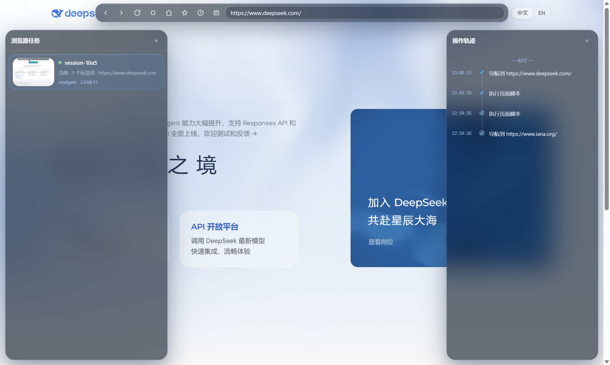

# dsh-browser-plus

> A visible browser runtime for DeepSeek Harness. Humans and agents operate the same real page, not a headless replay or screenshot proxy.

dsh-browser-plus is developed on top of the MIT-licensed `dsh-browser` codebase and independently maintained by ParticleLight.

[](https://github.com/ParticleLight/dsh-browser-plus)

## Why it exists

Browser automation should not disappear into a process the user cannot inspect. dsh-browser-plus keeps the browser window visible while giving agents reliable CDP control.

- **Visible by default**: a real Electron `WebContentsView`, not a headless relay.
- **Task isolation**: all DSH sessions share one visible window while keeping isolated task views, tabs, and history; the page task manager switches the visible view, and `browser_space` names browser tasks.
- **Human handoff**: page chrome, bookmarks, the task workspace, operation trail, and user activity detection live on the real page.
- **Glass workspace**: task and operation trail are independent translucent glass panels that can stay open together; selecting a task changes the visible task view and its operation trail. Each task shows its most recent visible-page thumbnail; background tasks retain their last image and are never force-shown or captured by a periodic timer.



- **Physical input**: keyboard, mouse, hover, double-click, and file selection use CDP instead of synthetic `element.click()` events.
- **Recovery-aware**: a recycled child re-materializes the same session view; the first recovered capture waits for compositor readiness.
- **Stable baseline**: Electron 42.9.3 is pinned; the resolver rejects Electron 43.4.1 because of compositor failures.

## Install

```sh
dsh plugin --profile web add github:ParticleLight/dsh-browser-plus
```

If another browser bundle is already installed, read the [migration guide](docs/MIGRATION.md), then restart DSH Web.

## Main capabilities

| Scenario | Tools |
| --- | --- |
| Open and inspect | `browser_open`, `browser_snapshot`, `browser_content`, `browser_screenshot` |
| Page interaction | `browser_click`, `browser_press_key`, `browser_double_click`, `browser_hover`, `browser_type` |
| Forms and files | `browser_fill`, `browser_upload_file`, `browser_wait_for` |
| Tasks and tabs | `browser_list_tabs`, `browser_switch_tab`, `browser_close_tab`, `browser_space` |
| Auth and recovery | `browser_auth`, `browser_reset_session`, `browser_history` |

Snapshot elements expose `loc=` for reliable retargeting, and page-level scripts automatically ignore the browser's own chrome.

## How it works

```text
browser_* tools
  -> BrowserRuntime (ctx.browser seam)
  -> ElectronBrowserProvider (CDP)
  -> RemoteElectronViewHost (loopback JSON-RPC)
  -> host-main.js (BrowserWindow + WebContentsView)
```

The chrome and task manager are injected through a closed Shadow DOM rather than a second Electron view. Background task updates stay in their isolated views and do not steal the user's visible page.

`alert`, `confirm`, and `prompt` are auto-accepted so pages do not block. The next page operation records the detail as a `dialog` item in `browser_history`.

## Reliability rules

1. Never reparent a visible `WebContentsView`.
2. The CDP capture fallback only touches siblings in the same window and restores them.
3. Native and full-page capture wait once for compositor readiness after child recovery.
4. Dialogs, captures, dynamic waits, and child recovery have regression tests and live SOAK coverage.

See [SOAK-CHECKLIST](docs/SOAK-CHECKLIST.md) for the complete runtime verification list.

## Development

```sh
npm install
npm run build
node --test test/host-composition.test.mjs test/page-chrome.test.mjs test/provider-actions.test.mjs
```

See [CONTRIBUTING.md](CONTRIBUTING.md) for contribution rules and [docs](docs/README.md) for the full documentation set.

## License

MIT. See [LICENSE](LICENSE) and [NOTICE](NOTICE.md).
