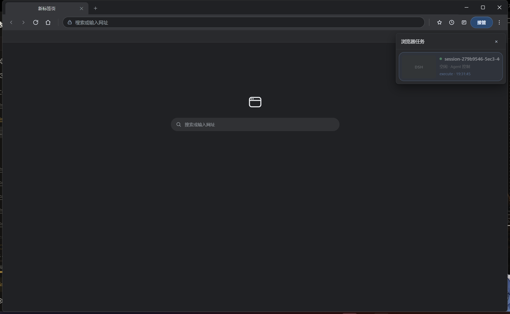

# dsh-browser-plus

专为 DeepSeek Harness（DSH）打造的 EGO 风格可视化 Agent 浏览器。基于 `dsh-browser` 构建，支持人机协同操作：用户可以在真实页面中操作，Agent 也能同步执行、接管和恢复任务。浏览器支持多任务流并行管理与切换，并完整记录 Agent 的操作轨迹；任务流和操作轨迹均配备独立的可视化菜单面板，让任务状态、页面缩略图与操作过程一目了然。

基于 MIT 许可的 `dsh-browser` 代码基础持续开发，并由 ParticleLight 独立维护。

[](https://github.com/deepseek-ai/deepseek-harness)
[](https://awesome-dsh-plugin.com)
[](https://www.npmjs.com/package/dsh-browser-plus)
[](https://www.npmjs.com/package/dsh-browser-plus)
[](https://github.com/ParticleLight/dsh-browser-plus/stargazers)
[](LICENSE)
[](https://github.com/ParticleLight/dsh-browser-plus/actions/workflows/ci.yml)
[](#安装)
[](https://github.com/ParticleLight/dsh-browser-plus/releases)

## 为何使用它

浏览器自动化不应躲在用户看不见的进程里。dsh-browser-plus 把浏览器窗口留在用户眼前，同时让 agent 获得可靠的 CDP 操作能力。

- **真实可见**：Electron `WebContentsView`，不是 headless relay。
- **任务隔离**：所有 DSH session 共享一个可见窗口，但各自保留隔离的任务视图、标签与历史；页面任务管理器切换可见视图，`browser_space` 命名浏览器任务。
- **人机协作**：工具栏是**常驻顶栏**（画在独立视图里，不随页面缩放）；书签、任务工作区与操作轨迹都在真实页面上运行，用户可在工具栏最右侧接管或显式交还给 Agent。
- **任务工作区**：任务与操作轨迹是彼此独立的不透明面板（Chrome 菜单表面 `#292a2d`），可同时打开；每项任务显示执行中、等待用户、用户接管、失败或空闲状态。缩略图仅在任务面板打开时为当前可见任务按需刷新，后台任务保留最后图像。



- **真实输入**：键盘、鼠标、hover、双击和文件选择都走 CDP，而不是 `element.click()` 伪事件。
- **恢复能力**：child 回收后会重新物化相同会话的视图；恢复后的首张截图等待 compositor 稳定。
- **稳定基线**：固定 Electron 42.9.3；43.4.1 的 compositor 故障会被 resolver 拒绝。

## 安装

从 npm 安装（推荐）：

```sh
dsh plugin --profile web add dsh-browser-plus
```

或直接从仓库安装：

```sh
dsh plugin --profile web add github:ParticleLight/dsh-browser-plus
```

已有浏览器 bundle 时，先阅读[迁移指南](docs/MIGRATION.md)，然后重启 DSH Web。

## 主要能力

| 场景 | 工具 |
| --- | --- |
| 打开与读取 | `browser_open`、`browser_snapshot`、`browser_content`、`browser_screenshot` |
| 打印与高亮 | `browser_pdf`、`browser_highlight` |
| 语义导航 | `browser_back`、`browser_forward`、`browser_reload`、`browser_stop`、`browser_scroll` |
| 快照引用 | `browser_click_ref`、`browser_scroll_into_view` |
| 页面交互 | `browser_click`、`browser_press_key`、`browser_double_click`、`browser_hover`、`browser_type` |
| 表单与文件 | `browser_fill`、`browser_upload_file`、`browser_wait_for` |
| 任务与交接 | `browser_tasks`、`browser_handoff`、`browser_list_tabs`、`browser_switch_tab`、`browser_close_tab`、`browser_space` |
| 登录与恢复 | `browser_auth`、`browser_reset_session`、`browser_history` |
| 对话框 | `browser_dialog` |
| 诊断 | `browser_console`、`browser_network` |
| 设备模拟 | `browser_emulate` |
| 拖拽 | `browser_drag` |
| 页面脚本 | `browser_execute` |
| 批量抓取 | `browser_scrape` |
| 下载 | `browser_download` |
| 回放 | `browser_replay` |
| 人机验证 | `browser_challenge` |
| 动作白名单 | `browser_restrict` |
| 会话 | `browser_session`、`browser_reset` |

快照返回短生命周期的 `snapshotId` 与元素引用；优先用 `browser_click_ref` 或 `browser_scroll_into_view` 操作，页面变化后重新快照。页面级脚本会自动过滤浏览器自身 chrome。

## 打开浏览器窗口

窗口默认只在 Agent 第一次调用浏览器工具时出现。人也可以自己打开它，有两个入口：

- **`/browser` 命令** —— 在输入框敲 `/`（或点 `+`）选「浏览器」，回车即打开或前置窗口。它**不产生模型消息**，只是把窗口带到眼前。
- **右侧栏「共享浏览器」** —— 在右侧栏的「添加」列表里选它，面板打开的同时窗口就被带出来了；面板里还有一个按钮可以随时再前置一次，并显示当前有几个浏览器任务。

> 右侧栏里 DSH 自带的「浏览器」是另一个东西：那是 DSH 自己的沙箱 iframe 浏览器，与这个自托管窗口无关。

## 工作方式

```text
browser_* tools
  -> BrowserRuntime (ctx.browser seam)
  -> ElectronBrowserProvider (CDP)
  -> RemoteElectronViewHost (loopback JSON-RPC)
  -> host-main.js (BrowserWindow + WebContentsView)
```

页面 chrome 和任务管理器通过 closed Shadow DOM 注入，而不是第二个 Electron view；任务状态与轨迹以版本化增量消息同步，后台任务更新自己的隔离视图，不会抢走用户当前可见页面。

`alert`、`confirm`、`prompt` **默认**会被立刻接受，避免页面卡死，详情记到 `browser_history` 的 `dialog` 条目。要驱动「确认删除」这类页面，先用 `browser_dialog` 设好**下一个**对话框怎么答（`accept` / `dismiss`，`prompt()` 可配 `promptText`）再触发它；`inspect` 报告上一次。

## 可靠性规则

1. 不 reparent 可见 `WebContentsView`。
2. CDP capture 回退只临时处理同一窗口的 sibling，并保证恢复。
3. child 恢复后，native 和 full-page capture 都只等待一次 compositor settle。
4. 对话框、截图、动态等待和 child recovery 均有回归测试与真实 SOAK 覆盖。

完整运行时检查见 [SOAK-CHECKLIST](docs/SOAK-CHECKLIST.md)。

## 开发

```sh
npm install
npm run build
npm test
npm run smoke:electron-host # 需要本地 DSH Web 已启动；验证真实 Electron Host 导航与页面交接
```

贡献方式见 [CONTRIBUTING.md](CONTRIBUTING.md)。更完整的使用说明在 [docs](docs/README.md)，版本变更见 [CHANGELOG](CHANGELOG.md)。

## License

MIT。详见 [LICENSE](LICENSE) 与 [NOTICE](NOTICE.md)。
